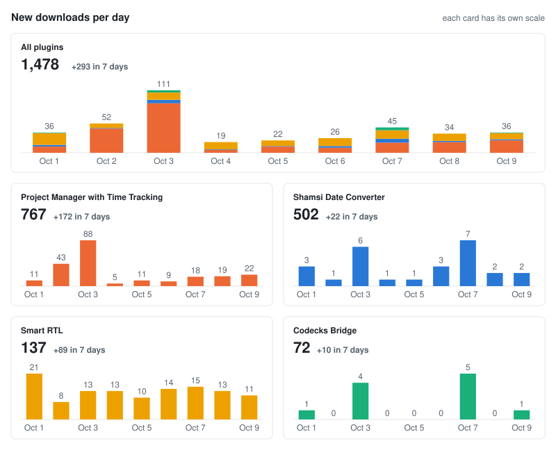

# milad-s5

<!-- plugin-stats:start -->
## Obsidian plugins

**1,509** total downloads across 5 plugins ([profile](https://community.obsidian.md/users/milad-s5)) · updated 2026-10-10

<picture>
  <source media="(prefers-color-scheme: dark)" srcset="stats/downloads-dark.svg">
  
</picture>

| Plugin | Downloads | Last 7 days |
|---|--:|--:|
| [Project Manager with Time Tracking](https://community.obsidian.md/plugins/project-manager-with-time-tracking) | 785 | +102 |
| [Shamsi Date Converter](https://community.obsidian.md/plugins/shamsi-date-converter) | 503 | +17 |
| [Smart RTL](https://community.obsidian.md/plugins/smart-rtl) | 147 | +86 |
| [Codecks Bridge](https://community.obsidian.md/plugins/codecks-bridge) | 73 | +7 |
| [Prompt Shelf](https://community.obsidian.md/plugins/prompt-shelf) | 1 | +0 |
| **Total** | **1,509** | **+212** |
<!-- plugin-stats:end -->
